# 👨🏻‍💻 Gabriel Angelo de jesus amaral

<h2 align="left">Olá! 👋</h2>

Sou estudante de <strong>Ciência de Dados na UNINTER</strong>, com foco em
<strong>Análise de Dados, Python, SQL e Business Intelligence</strong>.
  
Tenho desenvolvido minhas habilidades por meio de projetos práticos envolvendo
tratamento e análise de dados, bancos de dados, visualização e construção de
dashboards.
  
🎯 Atualmente, busco uma oportunidade de <strong>estágio na área de Dados</strong>,
onde possa aplicar meus conhecimentos, aprender com projetos reais e continuar
evoluindo profissionalmente.

---

## 🚀 Tecnologias e Ferramentas

### 📊 Dados e BI

  
  
  
  
  
  
  
  
  
  
  

 

  <strong>📊 Transformando dados em informação e conhecimento.</strong>

* 🐍 Python
* 🐼 Pandas
* 🔢 NumPy
* 🗄️ SQL
* 🐬 MySQL
* 🗃️ SQL Server
* 📊 Power BI
* 📗 Excel
* 📈 Matplotlib
* 🤖 Scikit-learn
* 📓 Jupyter Notebook

---

### 🛠️ Desenvolvimento e Ferramentas

  
  
  
  
  
  
  

---

## 📚 Atualmente estudando

* 🤖 Machine Learning
* 📊 Estatística para Dados
* 🐍 Python para Ciência de Dados
* 🗄️ Banco de Dados
* 🔎 SQL
* 🧠 Inteligência Artificial
* ⚙️ Engenharia de Dados

---

## 📂 Projetos em destaque

### 🏥 Projeto Hospitalar RJ

Projeto de análise de dados hospitalares utilizando **Python, SQL e Power BI**, com organização do processo de dados em camadas **Bronze, Silver e Gold**.

🔗 **[Ver projeto](https://github.com/gabriel-angelo-021/Projeto-Hospitalar-RJ)**

### 🛒 Projeto E-commerce

Projeto de banco de dados e análise de dados para um cenário de **E-commerce**, envolvendo modelagem, SQL, MySQL e Power BI.

🔗 **[Ver projeto](https://github.com/gabriel-angelo-021/Projeto-E-commerce)**

### 💵 Análise do Dólar

Projeto de análise da cotação do dólar utilizando **Python, Pandas, estatística e visualização de dados**.

🔗 **[Ver projeto](https://github.com/gabriel-angelo-021/Analise_do_Dolar)**

---

## 📊 GitHub Stats

  
  

## 📈 O que estou construindo

Meu objetivo é desenvolver projetos que demonstrem, na prática, minha capacidade de:

* 🔎 Explorar e entender dados
* 🧹 Realizar limpeza e tratamento de dados
* 🐍 Desenvolver análises utilizando Python
* 🗄️ Consultar e manipular bancos de dados com SQL
* 📊 Criar dashboards e indicadores no Power BI
* 📈 Transformar dados em informações relevantes
* 🤖 Aplicar Machine Learning em problemas de negócio
* 📁 Documentar projetos utilizando Git e GitHub

---

## 📫 Entre em contato

